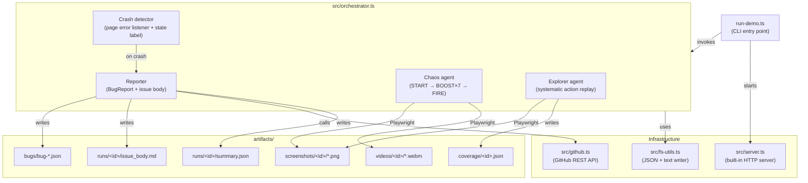

<picture>
  <source media="(prefers-color-scheme: dark)" srcset="docs/brand/logo-horizontal-dark.svg">
  
</picture>

# Repatrol

[](LICENSE)

**A Playwright QA swarm that plays your web app until it breaks, then files the bug report for you.**

Combining **Replay** and **Patrol**, **Repatrol** deploys an autonomous swarm that relentlessly "patrols" your application by replaying complex user flows until it identifies a failure.

Repatrol autonomously explores a target web application, stress-tests it through deterministic action sequences, detects crashes and state inconsistencies, captures screenshot and video evidence, and drafts a fully-formatted GitHub issue, all without a human in the loop.

---

## How It Works

```
┌─────────────────────────────────────────────────────────────────────┐
│                         Repatrol run flow                           │
└─────────────────────────────────────────────────────────────────────┘

  1. SERVE          Built-in HTTP server serves the target web game
                    (or point at any URL via TARGET_GAME_URL)
         │
         ▼
  2. EXPLORE        Playwright explorer agent visits every state,
                    clicks every button, records coverage:
                    TITLE → PLAY → CRASH (known states)
         │
         ▼
  3. STRESS         Chaos agent hammers the deterministic crash path:
                    START → BOOST ×7 → FIRE → observe result
         │
         ▼
  4. DETECT         Page error listener + state label check flag a crash.
                    Screenshots and video recorded for the full session.
         │
         ▼
  5. REPORT         BugReport JSON written to artifacts/bugs/.
                    GitHub issue body rendered (Markdown) and either
                    posted via the API or saved as a dry-run file.
         │
         ▼
  6. SUMMARISE      RunSummary JSON written to artifacts/runs/<id>/
                    with coverage stats, bug path, and issue URL.
```

---

## Features

- **Zero-config swarm** - one command launches the server, the explorer, and the chaos agent
- **Deterministic bug discovery** - structured action sequences find the same crash path every time
- **Coverage tracking** - records which states and actions were reached and when
- **Screenshot + video evidence** - every explorer step and the final chaos state are captured
- **GitHub issue drafting** - structured `BugReport` rendered as Markdown, posted or saved locally
- **Dry-run by default** - safe to run anywhere; pass a real token to open actual issues
- **Bring your own target** - override `TARGET_GAME_URL` to test any web app, not just the demo
- **Azure AI Foundry integration** - optional LLM smoke check to verify your Foundry deployment
- **Two run modes** - `demo` (fast, 6 explorer steps, 7-second chaos) or `soak` (deep, 20 steps, 15-second chaos)
- **Pure Node.js server** - no external static-file dependency; ships its own HTTP layer

---

## Quickstart

**Prerequisites:** Node.js 20+

```bash
git clone https://github.com/Microck/repatrol.git
cd repatrol
npm install
npx playwright install chromium
npm run demo
```

You will see JSON output on stdout. Look for:

```
bug_path=artifacts/bugs/bug-<id>.json
issue_url=https://github.com/owner/repatrol-dry-run/issues/dry-run
```

Open `artifacts/bugs/bug-<id>.json` to read the structured bug report, `artifacts/runs/<run_id>/issue_body.md` to see the draft GitHub issue, and `artifacts/screenshots/<run_id>/chaos-final.png` to see the crash frame.

---

## Installation

```bash
npm install
npx playwright install chromium
```

Copy `.env.example` to `.env` and fill in any credentials you want to use:

```bash
cp .env.example .env
```

---

## Usage

### `npm run demo`

Full end-to-end run. Starts the built-in server, launches the Playwright swarm in headless mode, detects the crash, and writes all artifacts. GitHub issue creation is dry-run (no token required).

```
serve game → explore → chaos stress → detect crash → capture evidence → draft issue
```

### `npm run serve`

Serves only the buggy web game at `http://127.0.0.1:4173/`. Useful for manual inspection or pointing an external tool at it.

```bash
npm run serve
# open http://127.0.0.1:4173
```

Pass `--port` to use a different port:

```bash
npx tsx scripts/serve-buggy-web-game.ts --port 8080
```

Pass `--check` to do a one-shot health check (exits 0 if the game is serveable, 2 if not):

```bash
npx tsx scripts/serve-buggy-web-game.ts --check
```

### `npm run smoke`

Fast sanity check. Starts the server on a random port, opens a browser, clicks START and BOOST once, writes a screenshot to `artifacts/screenshots/smoke-<ts>.png`, then exits. Exits 0 on success, 2 on failure. No artifacts besides the screenshot.

### `npm run foundry:smoke`

Validates your Azure AI Foundry deployment by sending a one-sentence prompt and printing the response. Exits 0 (with `SKIP:` message) if the four `FOUNDRY_*` env vars are not set. Exits 2 if the Foundry API returns an error.

### `npm run check`

TypeScript type-check without emitting output (`tsc --noEmit`). Run this before committing.

### `npm run build`

Compiles TypeScript to `dist/` via `tsc`.

### Advanced: run-demo.ts flags

```bash
npx tsx scripts/run-demo.ts \
  --serve \                   # start built-in server (omit to use TARGET_GAME_URL)
  --mode soak \               # demo (fast) | soak (deep)
  --port 4173 \               # port for built-in server
  --headless \                # run Chromium headless
  --dry-run-github            # skip real GitHub API call (default when no GITHUB_TOKEN)
```

---

## Configuration

Create a `.env` file (copy from `.env.example`):

```env
GITHUB_TOKEN=
GITHUB_REPO=owner/repatrol

FOUNDRY_ENDPOINT=
FOUNDRY_DEPLOYMENT=
FOUNDRY_API_VERSION=
FOUNDRY_API_KEY=
```

### GitHub Integration

| Variable | Description |
|---|---|
| `GITHUB_TOKEN` | Personal access token with `repo` scope. Omit to stay in dry-run mode. |
| `GITHUB_REPO` | Target repo in `owner/repo` format (default: `owner/repatrol`). |

When `GITHUB_TOKEN` is set and `--dry-run-github` is not passed, Repatrol calls `POST /repos/{owner}/{repo}/issues` via the GitHub REST API and prints the live issue URL.

### Target URL Override

Point the swarm at any web app instead of the built-in demo:

```bash
TARGET_GAME_URL="https://your-app.example.com/" npm run demo
```

When `TARGET_GAME_URL` is set, `--serve` is ignored.

### Azure AI Foundry (optional)

| Variable | Description |
|---|---|
| `FOUNDRY_ENDPOINT` | Azure AI Foundry endpoint URL |
| `FOUNDRY_DEPLOYMENT` | Model deployment name |
| `FOUNDRY_API_VERSION` | API version string (e.g. `2024-02-01`) |
| `FOUNDRY_API_KEY` | API key for the deployment |

All four must be set for `npm run foundry:smoke` to make a live call. If any are missing the command prints `SKIP:` and exits 0.

### Run Modes

| Mode | Explorer steps | Chaos duration | Use for |
|---|---|---|---|
| `demo` | 6 | 7 s | Quick demo, CI |
| `soak` | 20 | 15 s | Deeper coverage runs |

---

## Artifacts

All output lands under `artifacts/` (created automatically, git-ignored):

```
artifacts/
├── bugs/
│   └── bug-<id>.json          # Structured BugReport (one per detected crash)
├── coverage/
│   └── <run_id>.json          # CoverageSummary for the explorer phase
├── runs/
│   └── <run_id>/
│       ├── summary.json        # RunSummary - top-level result for this run
│       └── issue_body.md       # Rendered GitHub issue body (Markdown)
├── screenshots/
│   └── <run_id>/
│       ├── explorer-01.png     # Screenshots after each explorer action
│       ├── explorer-02.png
│       ├── ...
│       └── chaos-final.png     # State at the end of the chaos phase
└── videos/
    └── <run_id>/
        └── *.webm              # Full-session video recorded by Playwright
```

### `summary.json` structure

```json
{
  "run_id": "20240112-143022-a1b2c3",
  "mode": "demo",
  "target_url": "http://127.0.0.1:4173/",
  "coverage": { "..." : "..." },
  "bug_found": true,
  "bug_path": "artifacts/bugs/bug-3f9a1c2b.json",
  "issue_url": "https://github.com/owner/repatrol/issues/42",
  "issue_body_path": "artifacts/runs/<id>/issue_body.md",
  "summary_path": "artifacts/runs/<id>/summary.json"
}
```

`bug_found: false` means the chaos phase completed without detecting a crash or page error.

### `bug-<id>.json` structure

```json
{
  "bug_id": "bug-3f9a1c2b",
  "run_id": "20240112-143022-a1b2c3",
  "title": "Deterministic crash path triggered",
  "severity": "critical",
  "description": "Repatrol detected a deterministic unhandled exception after repetitive BOOST actions followed by FIRE.",
  "reproduction_steps": [
    "Open demo/buggy_web_game",
    "Click START",
    "Click BOOST seven times",
    "Click FIRE",
    "Observe crash and page error"
  ],
  "detected_at": "2024-01-12T14:30:22.000Z",
  "evidence": {
    "screenshot_path": "artifacts/screenshots/<run_id>/chaos-final.png",
    "video_path": "artifacts/videos/<run_id>/video.webm",
    "page_errors": ["DEMO_CRASH: START -> BOOST x7 -> FIRE"]
  }
}
```

### `coverage/<run_id>.json` structure

```json
{
  "run_id": "20240112-143022-a1b2c3",
  "observations": 7,
  "screens_seen": ["TITLE", "PLAY", "CRASH"],
  "actions_seen": ["click START", "click BOOST", "click BACK", "click FIRE", "click RESET"],
  "first_seen_at": { "TITLE": "2024-...", "PLAY": "2024-...", "CRASH": "2024-..." },
  "coverage_percent": 100.0,
  "coverage_path": "artifacts/coverage/<run_id>.json"
}
```

`coverage_percent` is calculated as `screens_seen / known_states × 100`. The three known states for the demo game are `TITLE`, `PLAY`, and `CRASH`.

---

## Architecture



---

## The Demo Game

`demo/buggy_web_game/` is a minimal single-page browser game with three states:

| State | How to reach |
|---|---|
| `TITLE` | Initial state / after RESET or BACK |
| `PLAY` | Click START |
| `CRASH` | In PLAY, click BOOST ≥7 times then click FIRE |

The crash is intentional and deterministic: `fireBtn` throws `new Error("DEMO_CRASH: START -> BOOST x7 -> FIRE")` when `boosts >= 7`. Repatrol's chaos agent is designed to discover and reproduce this path reliably.

---

## Development

**Typecheck:**

```bash
npm run check
```

**Build:**

```bash
npm run build
# output: dist/
```

**Run with visible browser (headed mode):**

```bash
npx tsx scripts/run-demo.ts --serve --mode demo
# omit --headless to watch Playwright interact with the game
```

**Debugging Playwright:**

Set `PWDEBUG=1` to launch the Playwright Inspector:

```bash
PWDEBUG=1 npx tsx scripts/run-demo.ts --serve
```

**Node version:** The project targets Node.js 20+. Use `nvm use 20` or `fnm use 20` if your shell needs switching.

---

## Testing

### Smoke test (`npm run smoke`)

Asserts that the built-in server starts, the game page loads, the browser can click START and BOOST without error, and a screenshot can be written to disk. Exits 0 on success, 2 on failure. No Playwright fixtures or test runner required. It is a plain TypeScript script.

### Foundry smoke (`npm run foundry:smoke`)

Asserts that your Azure AI Foundry deployment responds to a chat-completions request. Requires all four `FOUNDRY_*` env vars; gracefully skips if they are absent.

---

## Contributing

Issues and pull requests are welcome. Before opening a PR:

1. Run `npm run check` (must exit 0)
2. Run `npm run smoke` (must exit 0)
3. Keep changes focused; one PR per concern

---

## License

Apache-2.0. See [`LICENSE`](LICENSE).

---

## Origin

Built at the **Microsoft AI Dev Days Hackathon 2026** as a demonstration of autonomous QA agents powered by Playwright and Azure AI Foundry.
